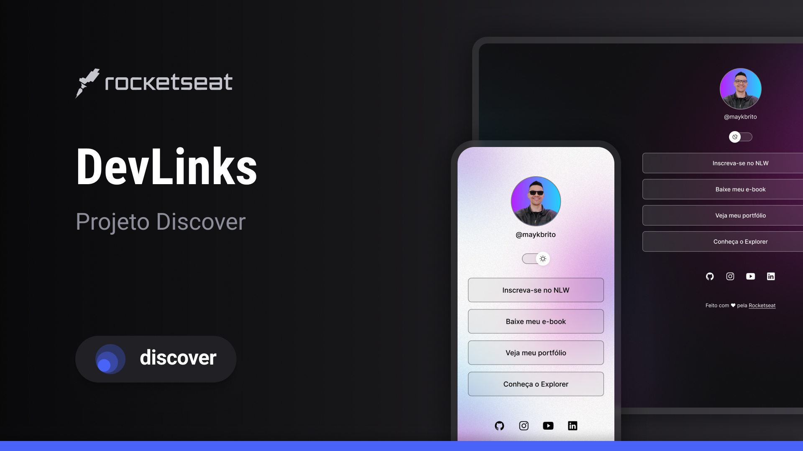

# DevLinks
----
Programa do curso Discorver, promovido pela Rocketseat.

### Tecnologias
----
* HMTL
* CSS
* JavaScript
* Figma

### Projeto
----
Agregador de links para ser utilizado como cartão de visitas.

O layout do projeto pode ser acessado [aqui](https://www.figma.com/file/uBcGk2RDLKpQeYn6zNgZzP/DevLinks-%E2%80%A2-Projeto-Discover-(Community)?type=design&mode=design&t=K1rIDbjKKXmkKlr5-0). Será necessário ter uma conta no Figma, para ter acesso as dimensões utilizadas.